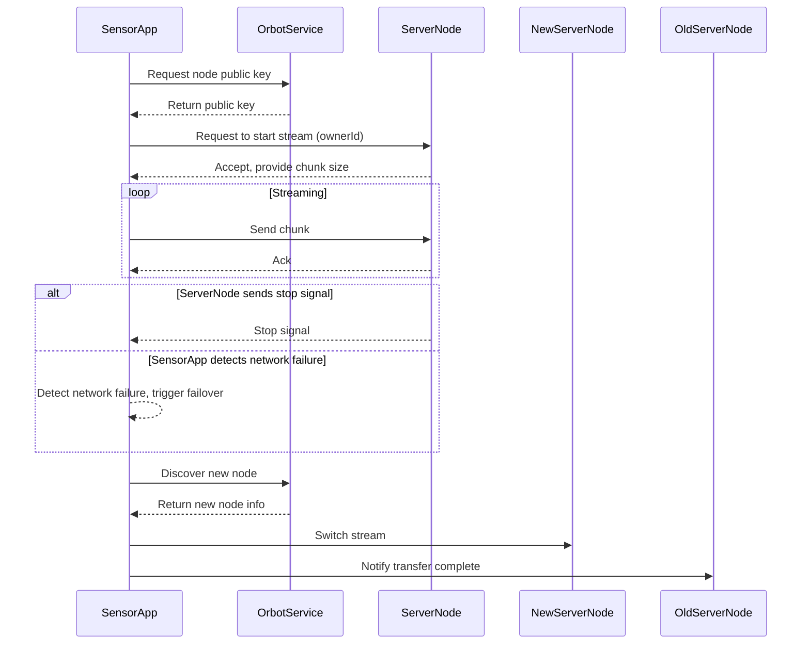

# SENSOR_APP_NETWORK_PRELIM: Research, Verification, and Implementation Plan (2025-12-09)

---

## 1. User Goals (as clarified)
- Enable robust, production-grade mesh-based streaming in the sensor app.
- Support streaming of time series data, audio, or video (audio may be embedded in video, not both separately).
- Handle network failures as stop signals.
- Support dynamic user access and replication.
- Document all research, codebase verification, and implementation steps with a tracking structure to ensure nothing is missed.
- Evaluate connection pool vs RTSP approaches for mesh streaming in this context.

---

## 2. Codebase Research: Literal Verification Table

| Symbol/Class/Method                  | File/Path (Line)                                                                 | Signature/Type/Status                                                                 | Notes/Discrepancies |
|--------------------------------------|----------------------------------------------------------------------------------|---------------------------------------------------------------------------------------|---------------------|
| `MeshNodeInfo`                       | SensorApp.kt (132, 138, 240)                                                     | Used as node descriptor for mesh storage/streaming                                    | Exists              |
| `HttpStreamIngestor`                 | SensorApp.kt (52, 114, 116, 222, 223), HttpStreamIngestor.kt (18)                | `class HttpStreamIngestor(endpoint: String, token: String? = null) : StreamIngestor`  | Exists              |
| `StreamIngestor`                     | StreamIngestor.kt (3), SensorApp.kt (67), LocalStreamIngestor.kt (14)            | `interface StreamIngestor`                                                            | Exists              |
| `AudioCapture`                       | SensorApp.kt (50, 145), AudioCapture.kt (16)                                     | `class AudioCapture(private val ingestor: StreamIngestor)`                            | Exists              |
| `videoFrameRate`, `videoFormat`      | SensorApp.kt (105, 106)                                                          | `var videoFrameRate`, `var videoFormat`                                               | Exists              |
| `listenForStopSignal`                | SensorApp.kt (240)                                                               | `fun listenForStopSignal(selectedNode: MeshNodeInfo)`                                 | Exists              |
| `MeshrabiyaAidlClient`               | MeshrabiyaAidlClient.kt (18)                                                     | `object MeshrabiyaAidlClient`                                                         | Exists              |
| `IMeshrabiyaService`                 | MeshrabiyaAidlClient.kt (10, 24, 31, 53)                                         | AIDL interface, used for IPC to fetch onion pubkey                                    | Exists              |
| `ServiceConnection`                  | MeshrabiyaAidlClient.kt (6, 28), Android API                                     | Android service binding                                                               | Exists              |
| `getOnionPubKey()`                   | MeshrabiyaAidlClient.kt (53)                                                     | Method on IMeshrabiyaService                                                          | Exists              |
| `connectionPool`                     | MeshEcosystemListener.kt, VirtualNode.kt, DistributedStorageManager.kt, etc.     | `MeshConnectionPool` singleton, used for mesh connections                             | Exists              |
| `AccessScope`, `replicationLevel`    | MeshComputeDataDefinitions.kt, DistributedStorageManager.kt                      | Used for file access/replication control                                              | Exists              |
| `RTSP` (protocol/class)              | No matches found                                                                 | Not implemented in codebase                                                           | Not present         |

---

## 3. Research Results: Connection Pool vs RTSP in Mesh Streaming

**Connection Pool (MeshConnectionPool)**
- **Purpose:** Manages a pool of mesh network connections for efficient, concurrent data transfer.
- **Pros:**
    - Well-integrated with mesh stack (used in storage, compute, and service layers).
    - Supports concurrent access, resource reuse, and connection health monitoring.
    - Flexible for both time series and media streaming (can multiplex streams).
    - Can enforce access control and replication at the connection/task level.
    - Already used for file storage and compute task data transfer.
- **Cons:**
    - Requires custom protocol for media streaming (no standard for video/audio).
    - More complex to implement real-time media streaming (timing, jitter, etc.).
    - Not natively interoperable with standard media clients (e.g., VLC, ffmpeg).

**RTSP (Real Time Streaming Protocol)**
- **Purpose:** Standard protocol for controlling streaming media servers (audio/video).
- **Pros:**
    - Widely supported by media clients and libraries.
    - Built-in support for media control (play, pause, seek).
    - Designed for real-time, low-latency streaming.
- **Cons:**
    - Not present in current codebase; would require significant new implementation.
    - Not mesh-aware: would need adaptation for peer-to-peer, multi-hop, and dynamic topology.
    - Harder to enforce mesh-specific access control, replication, and dynamic user access.
    - May not fit time series or non-media data as cleanly as custom protocols.

**Contextual Fit:**
- For mesh, where access control, replication, and dynamic topology are critical, connection pool with custom protocol is more flexible and already partially implemented.
- RTSP is attractive for standard video/audio streaming but would require major new work and mesh adaptation.

---

## 4. Data Types and Streaming Requirements

- **Time Series Data:** Sensor readings, logs, etc. (low bandwidth, high frequency, tolerant to some loss).
- **Audio:** Can be streamed alone or as part of video (e.g., embedded in video stream).
- **Video:** May include audio; not expected to stream both separately and together.
- **Replication:** Mesh must support multiple nodes storing/relaying the same stream.
- **Dynamic User Access:** Users may join/leave, require access to live or recent data.

---

## 5. Implementation Plan: Tracking Structure

**A. Foundation**
    1. [ ] Verify all mesh node discovery and selection logic (`MeshNodeInfo`, `discoverStorageNodes`, `selectBestNode`)
    2. [ ] Confirm streaming interface and controller classes (`StreamIngestor`, `HttpStreamIngestor`, `AudioCapture`)
    3. [ ] Validate stop signal and network failure handling (`listenForStopSignal`, error callbacks)
    4. [ ] Confirm AIDL IPC for node public key (`MeshrabiyaAidlClient`, `IMeshrabiyaService`, `getOnionPubKey`)

**B. Streaming Architecture**
    1. [ ] Decide on protocol: connection pool (custom) vs RTSP (standard)
            - [ ] Document rationale and tradeoffs (see above)
            - [ ] If RTSP, plan for mesh adaptation layer
    2. [ ] Define stream session lifecycle (start, stop, failover)
    3. [ ] Specify data types and multiplexing (audio, video, time series)
    4. [ ] Plan for replication and dynamic access (access control, join/leave)

**C. Implementation Steps**
    1. [ ] Implement/extend mesh connection pool for streaming
            - [ ] Add stream session management (init, teardown, error handling)
            - [ ] Support for time series and media payloads
    2. [ ] Integrate streaming controllers (audio/video) with mesh transport
    3. [ ] Implement stop signal and network failure workflow
    4. [ ] Add replication and access control logic
    5. [ ] Test with simulated and real mesh nodes

**D. Validation**
    1. [ ] Unit and integration tests for all streaming modes
    2. [ ] Failure injection: simulate network loss, node churn
    3. [ ] Performance and scalability benchmarks

---

## 6. Pros/Cons Table: Connection Pool vs RTSP

| Feature/Requirement         | Connection Pool (Current) | RTSP (Standard)         |
|----------------------------|---------------------------|-------------------------|
| Mesh integration           | Native, existing          | Requires adaptation     |
| Access control             | Fine-grained, flexible    | Not built-in            |
| Replication                | Supported, customizable   | Not standard            |
| Dynamic user access        | Supported                 | Not standard            |
| Time series data           | Easy                      | Not standard            |
| Audio/video streaming      | Needs custom protocol     | Native                  |
| Client compatibility       | Custom clients only       | Standard clients        |
| Implementation effort      | Incremental, lower        | High, new work          |

---

## 7. Next Steps

- **Finalize protocol choice** (likely connection pool + custom protocol for mesh, with possible RTSP gateway for standard clients).
- **Update SENSOR_APP_NETWORK_PRELIM.md** with this research, tracking structure, and rationale.
- **Proceed with stepwise implementation, using the tracking structure above.**

---

## 8. Discrepancies/Uncertainties

- RTSP is not present in the codebase; would require new implementation.
- No evidence of mesh-native media streaming protocol; must be designed or adapted.
- Replication and access control logic is present for files, not yet for streams.
- Dynamic user access for live streams needs further design.

---

**This structure ensures all research, verification, and planning is explicit, actionable, and traceable.**

# SENSOR_APP_NETWORK_PRELIM

## 1. Current State of SensorApp Networking & Streaming

### A. SensorApp.kt Overview
- Streams sensor, camera, and audio data from Android device to remote server.
- Uses `HttpStreamIngestor` for HTTP-based streaming to a hardcoded endpoint.
- Mesh integration is only pseudo-code stubs for node discovery and selection.
- Multi-sensor selection supported; each sensor’s readings are streamed.
- Streaming events tracked via `SharedFlow` for UI logging.

### B. Mesh Node Discovery & Selection
- Functions for mesh node discovery/selection exist as stubs.
- Intended workflow: discover mesh nodes, select best, update endpoint, start streaming.

### C. Streaming Control & Failover
- Pseudo-code for stop signal handling and stream switching.
- No explicit buffering logic; would be required for seamless failover.
- **Network failure detection:** SensorApp must detect network failures during streaming. On failure, it must trigger the same workflow as if the server node sent a stop message (i.e., initiate failover to a new node, buffer unsent data, and resume streaming).

### D. Key Management
- No implemented logic for retrieving Tor-based node public/private key from Orbot.
- Required for canonical workflows and owner identification.

---

## 2. Best Practices for AIDL Integration (Orbot + Meshrabiya + SensorApp)

### A. AIDL Service Integration Pattern
- Define `.aidl` files for IPC contracts (e.g., `IMeshrabiyaService`).
- Orbot implements the AIDL service, exposing node key retrieval and mesh operations.
- SensorApp binds to the AIDL service using `ServiceConnection`, obtains proxy, calls methods.
- Use AIDL to fetch Tor node public/private key combo. Public key (or hash) is `ownerId` in workflow messages.

### B. Canonical Key Usage
- Research best practies for finding or node public key in Orbot App Use Tor node public key (or hash) as canonical `ownerId` for all workflow messages/data objects.
- Never transmit private keys; use AIDL to sign data or perform cryptographic operations within Orbot.

### C. Integration Steps
1. Define AIDL interface for key/mesh operations.
2. Implement service in Orbot, backed by Meshrabiya logic.
3. Implement AIDL client in SensorApp.
4. Handle service connection failures, permission issues, fallback to simulated logic if needed.

---

## 3. Best Practices for Multi-Sensor Streaming over Mesh

### A. Streaming Architecture
- Use connection pools to manage mesh connections efficiently (reuse Meshrabiya pool or design lightweight pool).
- Implement local buffer for sensor data to handle failover and node switching.
- Stream data in defined chunks (using `streaming_chunk` constant or RTSP-like protocol).

### B. Canonical Workflow Patterns
1. **Request to Start Stream:** SensorApp requests to start stream with server node; server responds with acceptance and chunk size.
2. **Streaming:** SensorApp streams data in chunks; server node saves data to disk for replication/task access.
3. **Stop Signal, Network Failure & Failover:**
    - If the server node notifies SensorApp to stop, or if SensorApp detects a network failure during streaming, SensorApp must trigger the failover workflow: request a new node, switch stream, buffer and flush unsent data, and notify the previous node when transfer is complete.
4. **Replication & Access Control:** Data stored with metadata for replication/access; encryption model supports sharing/updating access.

### C. Data Format & Replication
- Use format supporting chunking, metadata, easy replication (e.g., content-addressed storage, Merkle trees).
- Encrypt data per stream, keys managed via mesh/Orbot key infrastructure. Support sharing/updating access.

---

## 4. Requirements & Deliverables

### A. Functional Requirements
- AIDL-based IPC for key retrieval and mesh operations.
- Multi-sensor selection and streaming from SensorApp to distributed storage nodes.
- Connection pooling for mesh endpoints in Orbot and SensorApp.
- Buffering and failover logic for seamless stream switching.
- Canonical workflows for start/stop streaming, failover, and data replication.
- Data format and encryption model supporting replication and multi-entity access.

### B. Deliverables
- AIDL interface definitions and documentation.
- Orbot service implementation for mesh/key operations.
- SensorApp AIDL client logic and mesh streaming integration.
- Connection pool and buffering implementation.
- Workflow documentation and code samples for canonical streaming patterns.
- Encryption and replication model documentation.

### C. Caveats & Uncertainties
- AIDL integration requires both apps installed and permissioned.
- Mesh node discovery/selection logic must be robust and handle network failures.
- Failover/buffering must be tested under real-world conditions.
- Encryption/access control models must be reviewed for security/scalability.
- Replication logic must be compatible with distributed storage/task access requirements.

---

## 5. Canonical Workflow Summary

| Step                | Actor      | Action/Message                                      | Notes/Best Practices                        |
|---------------------|------------|-----------------------------------------------------|---------------------------------------------|
| Start Stream        | SensorApp  | Request to server node via mesh (AIDL/IPC)          | Include ownerId (Tor pubkey/hash)           |
| Accept Stream       | ServerNode | Accept, provide chunk size, endpoint                | Use connection pool for efficiency          |
| Stream Data         | SensorApp  | Send data in chunks, buffer locally                 | Use canonical chunking, encrypt per stream  |
| Save Data           | ServerNode | Store data, update replication metadata             | Format for replication/task access          |
| Stop Signal         | ServerNode | Notify SensorApp to stop transfer                   | Graceful failover, buffer unsent data       |
| Stop Signal / Network Failure | ServerNode / SensorApp | Notify SensorApp to stop transfer OR SensorApp detects network failure | Graceful failover, buffer unsent data       |
| Switch Node         | SensorApp  | Request new node, switch stream, notify old node    | Flush buffer, update endpoint               |
| Replication         | ServerNode | Replicate data, update access control               | Use mesh encryption model                   |

---

## 6. Workflow Diagrams

### A. Streaming Start/Stop/Failover



---

## 7. Code Samples

### A. AIDL Service Binding (SensorApp)
```kotlin
// Bind to Orbot's AIDL service
val serviceConnection = object : ServiceConnection {
    override fun onServiceConnected(name: ComponentName?, binder: IBinder?) {
        val meshService = IMeshrabiyaService.Stub.asInterface(binder)
        val pubKey = meshService.getOnionPubKey()
        // Use pubKey as ownerId
    }
    override fun onServiceDisconnected(name: ComponentName?) {}
}
val intent = Intent("com.ustadmobile.orbot.MESHRABIYA_SERVICE")
intent.setPackage("com.ustadmobile.orbot")
context.bindService(intent, serviceConnection, Context.BIND_AUTO_CREATE)
```

### B. Streaming with Buffering and Failover
```kotlin
class MeshStreamManager {
    private val buffer = ArrayDeque<ByteArray>()
    private var currentNode: MeshNodeInfo? = null
    fun streamData(data: ByteArray) {
        buffer.addLast(data)
        flushBuffer()
    }
    fun flushBuffer() {
        while (buffer.isNotEmpty() && currentNode != null) {
            val chunk = buffer.removeFirst()
            // send chunk to currentNode
        }
    }
    fun onStopSignalOrNetworkFailure() {
        // Pause streaming, discover new node
        currentNode = discoverNewNode()
        flushBuffer()
    }
    fun onNetworkFailure() {
        // Detect network failure and trigger same workflow as stop signal
        onStopSignalOrNetworkFailure()
    }
}
```

### C. Canonical Workflow Message
```kotlin
data class StreamStartRequest(
    val ownerId: String, // Tor pubkey or hash
    val streamId: String,
    val sensors: List<String>,
    val chunkSize: Int
)
```

---

## 8. Onboarding Summary for New Agents
- Review SensorApp.kt for current streaming and sensor selection logic.
- Understand AIDL IPC patterns for Android service integration.
- Plan for robust mesh node discovery, selection, and failover.
- Implement connection pooling and buffering for streaming reliability.
- Follow canonical workflow patterns for streaming, failover, and replication.
- Use Tor node public key (or hash) as ownerId in all workflow messages.
- Document all changes, caveats, and uncertainties for future development.
